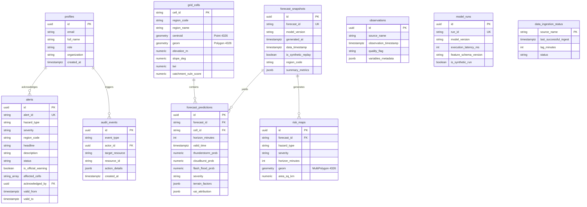

# TRINETRA Database Architecture & PostGIS Schema (Phase 2)

## 1. Entity-Relationship Diagram (ERD)

---

## 2. Spatial & Temporal Indexing Strategy

| Table | Index Name | Index Type | Target Columns / Expression | Operational Purpose |
| :--- | :--- | :---: | :--- | :--- |
| `grid_cells` | `idx_grid_cells_geom` | **GIST** | `geom` | Spatial intersection & point-in-polygon queries. |
| `grid_cells` | `idx_grid_cells_centroid` | **GIST** | `centroid` | Fast proximity & radius lookups from monitoring stations. |
| `risk_maps` | `idx_risk_maps_geom` | **GIST** | `geom` | Vector tile generation & hazard polygon clipping. |
| `forecast_snapshots`| `idx_forecast_snapshots_data_time` | **B-TREE** | `data_timestamp DESC` | Retrieval of latest nowcast run for console display. |
| `forecast_predictions`| `idx_predictions_valid_time` | **B-TREE** | `valid_time` | Timeline scrubber queries (T+0 to T+6h). |
| `alerts` | `idx_alerts_valid_window` | **B-TREE** | `valid_from, valid_to` | Active warning query filtering out expired events. |
| `audit_events` | `idx_audit_events_created`| **B-TREE** | `created_at DESC` | Compliance audit trail retrieval. |

---

## 3. Row Level Security (RLS) Matrix

| Table | Viewer / Public | Analyst | Incident Commander | Administrator |
| :--- | :---: | :---: | :---: | :---: |
| `grid_cells` | SELECT | SELECT | SELECT | ALL |
| `forecast_snapshots` | SELECT | SELECT | SELECT | ALL |
| `forecast_predictions`| SELECT | SELECT | SELECT | ALL |
| `risk_maps` | SELECT | SELECT | SELECT | ALL |
| `alerts` | SELECT | SELECT, UPDATE (Acknowledge) | SELECT, INSERT, UPDATE (Issue Official) | ALL |
| `profiles` | SELECT (Self) | SELECT (Self), UPDATE (Self) | SELECT (Self), UPDATE (Self) | ALL |
| `audit_events` | NONE | SELECT | SELECT, INSERT | ALL |
| `data_ingestion_status`| SELECT | SELECT | SELECT | ALL |
