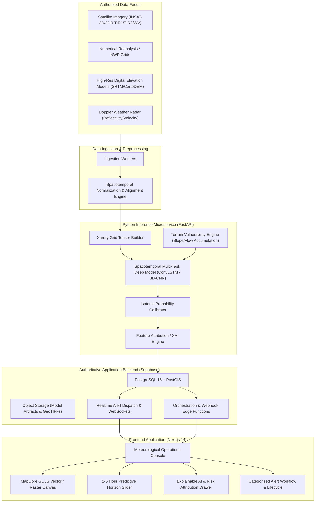

# TRINETRA System Architecture Overview

## 1. Executive Summary

TRINETRA delivers hyper-local nowcasts for severe convective and hydrological hazards with a 2–6 hour actionable lead window. The system separates interactive decision-support visualization, authoritative data persistence, and heavy scientific computation into modular, decoupled layers.

---

## 2. Component Responsibilities

### 2.1 Web Frontend (`apps/web`)
- **Role**: High-density GIS operations console designed for disaster management authorities and meteorologists.
- **Key Capabilities**:
  - WebGL/WebGPU-accelerated multi-layer map rendering via **MapLibre GL JS**.
  - Multi-hazard probability surface visualization (Thunderstorm, Cloudburst, Flash Flood).
  - Time-scrubbing controls with 15-minute resolution across the 2–6 hour forecast horizon.
  - Drill-down inspector for single-grid-cell atmospheric sounding profiles and terrain indices.
  - Strict UI state model: Loading, Fresh, Degraded, Stale (>45 min lag), and Offline.

### 2.2 Application Backend (`supabase/`)
- **Role**: System-of-record, spatial database, user identity, and real-time pub/sub.
- **Key Capabilities**:
  - Spatial indexes (`GIST`) on grid centroids and polygon hazard zones.
  - Row Level Security (RLS) enforcing access roles: `viewer`, `analyst`, `incident_commander`, `admin`.
  - Realtime publication on `alerts` and `forecast_snapshots` tables.
  - Audit logging of alert acknowledgments and operational escalations.

### 2.3 ML Inference Microservice (`services/inference`)
- **Role**: Stateless, containerized Python service executing scientific calculations and model inference.
- **Key Capabilities**:
  - Processing satellite and atmospheric multi-band rasters into aligned 4D tensors `(batch, time, channels, lat, lon)`.
  - Spatiotemporal multi-task neural network generating calibrated probabilities for each hazard.
  - DEM terrain analysis computing topographic wetness index (TWI), slope, and drainage basin flow accumulation.
  - Fast response times (<1.5s for regional inference tile) with documented latency budgets.
